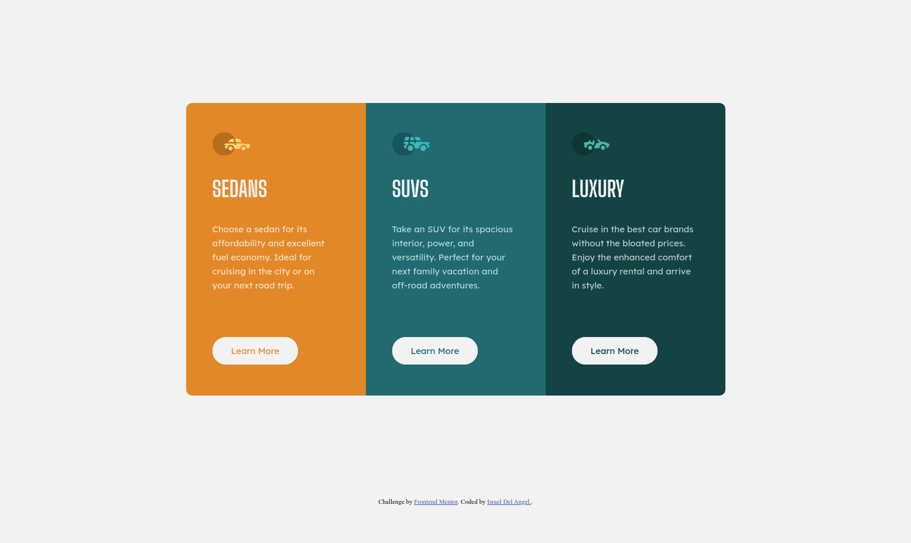
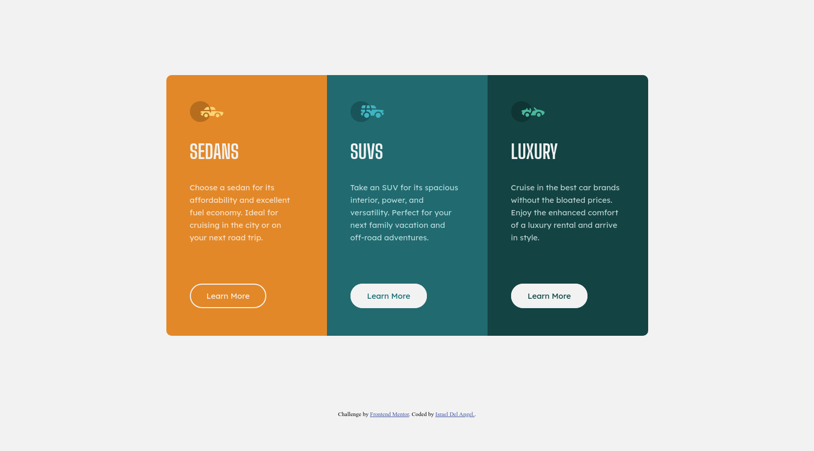
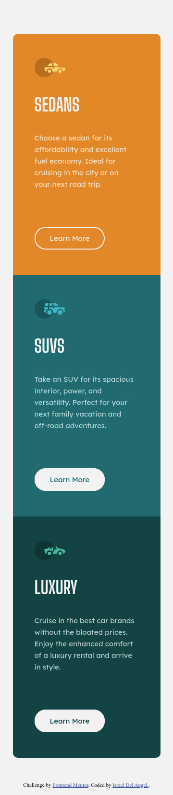

# Frontend Mentor - 3-column preview card component solution

This is a solution to the [3-column preview card component challenge on Frontend Mentor](https://www.frontendmentor.io/challenges/3column-preview-card-component-pH92eAR2-). Frontend Mentor challenges help you improve your coding skills by building realistic projects.

## Table of contents

- [Overview](#overview)
  - [The challenge](#the-challenge)
  - [Screenshot](#screenshot)
  - [Links](#links)
- [My process](#my-process)
  - [Built with](#built-with)
  - [What I learned](#what-i-learned)
  - [Continued development](#continued-development)
  - [Useful resources](#useful-resources)
- [Author](#author)

## Overview

### The challenge

My challenge was to build out this 3-column preview card component and get it looking as close to the design as possible

Users should be able to:

- View the optimal layout depending on their device's screen size
- See hover states for interactive elements

### Screenshots

### Links

- Solution URL: [Add solution URL here](https://www.frontendmentor.io/solutions/3column-preview-card-solution-using-basic-html-and-css-mdTMXzc4y)
- Live Site URL: [Add live site URL here](https://eager-swartz-fcb9ff.netlify.app/)

## My process

### Built with

- Semantic HTML5 markup
- CSS custom properties
- Flexbox

### What I learned

I learned that I can easily adapt a flexbox element or group of elements for any screen size. I'm still not confident about more complex designs, but I know that eventually I'll get there.

### Continued development

I'm still confused about how to position a div into the middle of the screen, unless I use 100vh as height. But really, the problem starts when making my site responsive , especially when theres a div within a div (e.g. a horizontal rectangle within another horizontal rectangle)... I'll keep studying and ask around if I get lost.

### Useful resources

- [Example resource 1](https://www.udemy.com) - I've been learning on Udemy.com and whatever I've learned have put into action here.

## Author

- Frontend Mentor - [@mexwebdev21](https://www.frontendmentor.io/profile/mexwebdev21)
- Twitter - [@mexwebdev2121](https://twitter.com/mexwebdev2121)
